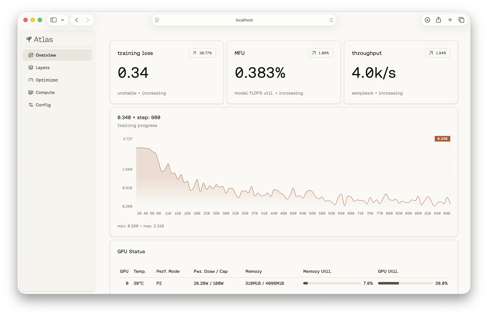
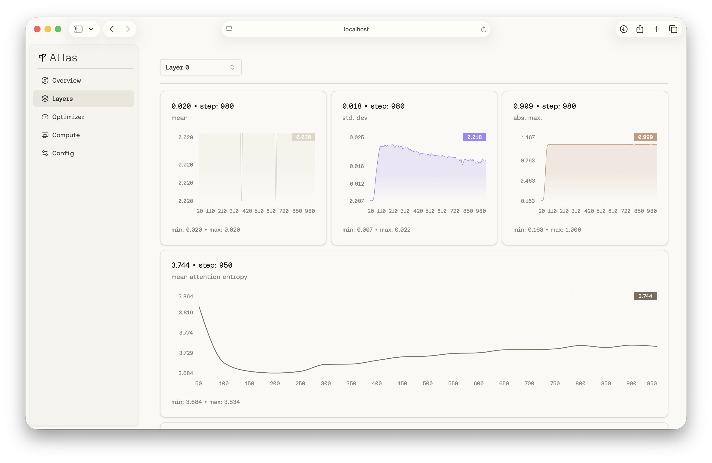

# Atlas Dashboard

A real-time dashboard for monitoring machine learning training metrics.

## Features

- Real-time visualization of training metrics (loss, MFU, throughput)
- Per-layer weight and gradient statistics
- GPU hardware monitoring (temperature, memory usage)
- Message history with replay functionality
- WebSocket-based data ingestion from producers

Stores records in a SQLite database using Bun. Uses WebSockets from Bun for real-time data ingestion and dashboard updates.

## Screenshots




## Setup

Install dependencies:

```bash
bun install
```

## Running

Development mode:

```bash
bun run serve dev
```

Production mode:

```bash
bun run build
bun run serve
```

Access the dashboard at <http://localhost:2626>

## API

See [API_GUIDE.md](API_GUIDE.md) for detailed API documentation, including WebSocket endpoints and message schemas.
